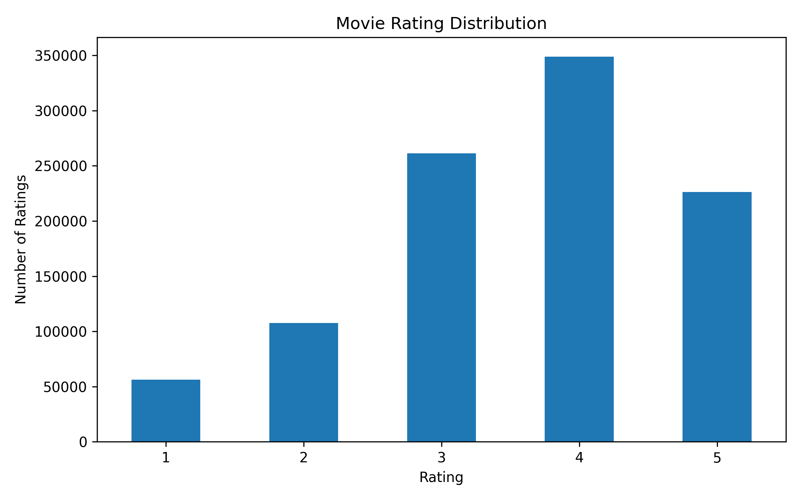
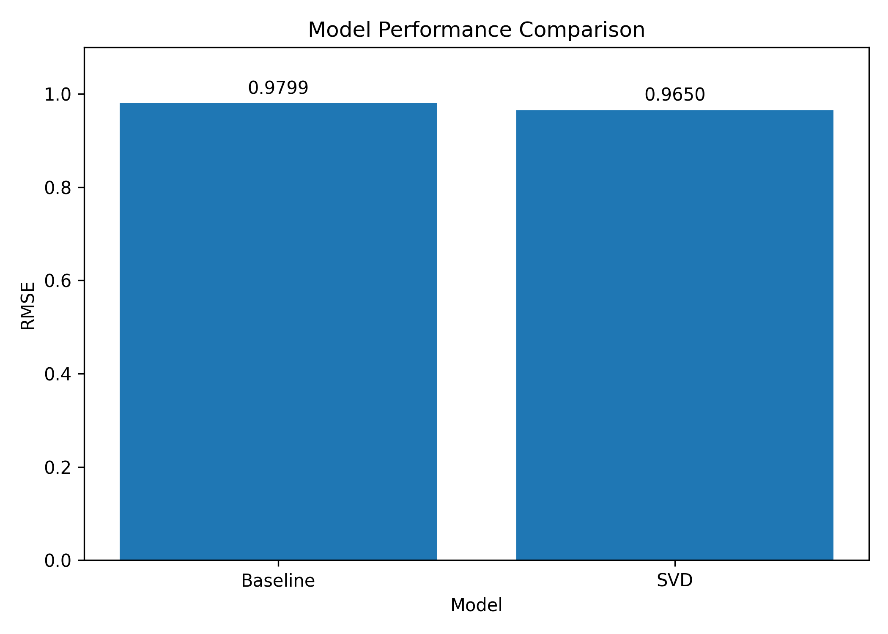
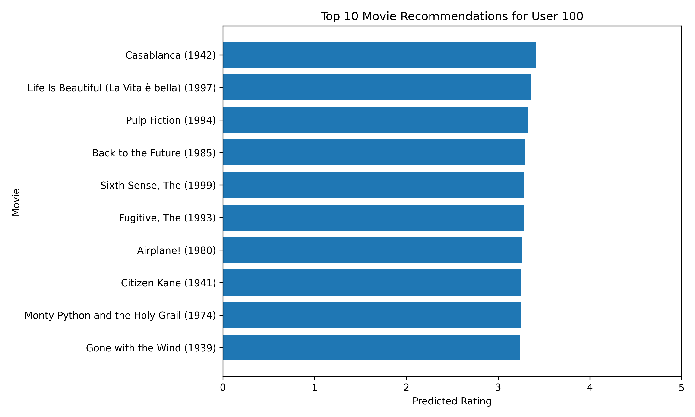

# Movie Recommendation System

A machine learning-based movie recommendation system built using the MovieLens 1M dataset.

## Project Overview

This project implements multiple recommendation techniques:

- Content-Based Filtering
- Collaborative Filtering
- Matrix Factorization using SVD
- Hybrid Recommendation
- Top-K Recommendation Evaluation

## Dataset

MovieLens 1M

- 3,883 movies
- 6,040 users
- 1,000,209 ratings

Dataset source:
https://grouplens.org/datasets/movielens/1m/

The original dataset is not included in this repository.

## Recommendation Methods

### 1. Content-Based Filtering

Uses movie genres to find similar movies.

Techniques:
- TF-IDF
- Cosine Similarity

### 2. Collaborative Filtering

Uses user-movie ratings to identify movies with similar rating patterns.

Techniques:
- User-Movie Rating Matrix
- Movie-Movie Cosine Similarity

### 3. Matrix Factorization

Uses Truncated SVD to discover latent relationships between users and movies.

Configuration:
- 50 latent factors

### 4. Hybrid Recommendation

Combines content-based and collaborative recommendations.

## Model Evaluation

### Rating Prediction

| Model | RMSE |
|---|---:|
| Baseline | 0.9799 |
| SVD | 0.9650 |

Lower RMSE indicates lower prediction error on the test split.

### Top-K Recommendation

| Metric | Score |
|---|---:|
| Precision@10 | 0.1801 |
| Recall@10 | 0.1067 |

Movies rated 4 or 5 in the test set were considered relevant.

## Visualizations

### Rating Distribution

### Model Comparison

### Example Recommendations

## Technologies Used

- Python
- Pandas
- NumPy
- Scikit-learn
- Matplotlib
- Google Colab

## Project Structure

movie-recommendation-system/

    notebooks/
        Movie_Recommendation_System_MovieLens_1M.ipynb

    data/
        README.md

    results/
        model_results.csv
        top_k_results.csv
        user_100_recommendations.csv

    images/
        rating_distribution.png
        model_comparison.png
        recommendation_chart.png

    README.md
    requirements.txt
    .gitignore

## How to Run

1. Clone the repository.
2. Install the required packages:

pip install -r requirements.txt

3. Download the MovieLens 1M dataset.
4. Open the notebook in Google Colab or Jupyter Notebook.
5. Run the cells sequentially.

## Example

For User 100, the SVD model generated recommendations including:

- Casablanca
- Life Is Beautiful
- Pulp Fiction
- Back to the Future
- The Sixth Sense

The predicted ratings are generated by the trained SVD model.

## Future Improvements

- Improve hybrid recommendation scoring
- Experiment with different SVD configurations
- Add cold-start handling
- Build a Streamlit web application
- Compare Python implementation with RapidMiner
- Deploy the recommendation system

## Author

AAHIL
